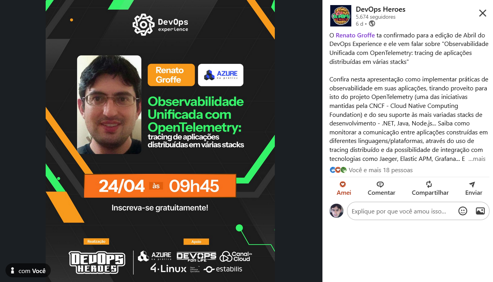

# OpenTelemetry_DevOpsExperience-2025-04
Conteúdos sobre OpenTelemetry de apresentação realizada durante a edição de Abril-2025 do DevOps Experience.

Aplicações (incluindo ambiente para uso de Jaeger + OpenTelemetry):
- [**API de Contagem de acessos (.NET 9 + ASP.NET Core)**](https://github.com/renatogroffe/aspnetcore9-otel-jaeger-postgres-mysql_apicontagem)
- [**API Saudações (Node.js)**](https://github.com/renatogroffe/nodejs-otel-jaeger_apisaudacoes)
- [**Consumer das APIs (Java + Spring + Apache Camel)**](https://github.com/renatogroffe/nodejs-otel-jaeger_apisaudacoes)

Scripts para uso com outras tecnologias de Observabilidade/Tracing:
- [**Docker Compose com ambiente para utilização do Zipkin**](https://github.com/renatogroffe/otel-zipkin-postgres-mysql_distributed-tracing)
- [**Docker Compose com ambiente para utilização do Elastic APM**](https://github.com/renatogroffe/otel-elasticapm-postgres-mysql_distributed-tracing)

---

Título da apresentação: **Observabilidade Unificada com OpenTelemetry: tracing de aplicações distribuídas em várias stacks**

Data: **24/04/2025 (quinta-feira)**

Tipo do evento: **Online**

Ferramenta de transmissão: **Zoom**

Tecnologias e tópicos abordados: **OpenTelemetry, Observabilidade, Monitoramento, SRE, Containers, DevOps, Microsoft Azure, Application Insights, Azure Monitor, Log Analytics, Docker, Docker Compose, .NET, ASP.NET Core, Java, Spring, Apache Camel, Node.js SQL Server, PostgreSQL, MySQL, Linux, CNCF, Cloud Native...**

Número de participantes: **86 pessoas (pico de audiência ao longo da live)**

Link do evento: [**LinkedIn**](https://www.linkedin.com/posts/devopsheroes_o-renato-groffe-ta-confirmado-para-a-edi%C3%A7%C3%A3o-activity-7320551983067615234-Tzy_/)

Esta palestra foi realizada em conjunto com meu amigo **Diego Moreira Matos (Microsoft MVP)**.

Deixamos aqui nossos agradecimentos ao **Daniel Ginês** e à **Aline Martins** por todo o apoio para que participássemos como palestrantes de mais uma edição do **DevOps Experience**.

---

Outros prints podem ser encontrados neste [**diretório**](/img/).
